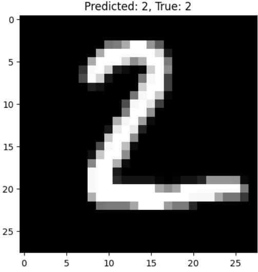
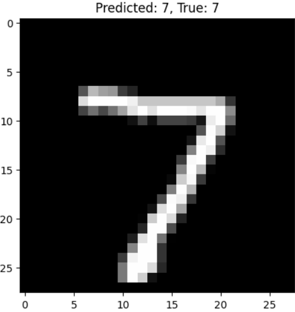

# MNIST Image Classification Using CNN

## Description
This project demonstrates the use of Convolutional Neural Networks (CNNs) to classify handwritten digits from the MNIST dataset. The MNIST dataset consists of 28x28 pixel grayscale images of digits 0-9. A CNN model is built to predict the digit from these images, using various layers like convolution, pooling, dropout, and dense layers to achieve high accuracy.

## Requirements
- Python 3.x
- TensorFlow 2.x
- Keras
- NumPy
- Matplotlib
- scikit-learn

To install the required libraries, run the following command:
bash
pip install -r requirements.txt

## How to Run:
Clone this repository:
bash
git clone https://github.com/your-username/MNIST-Image-Classification-Using-CNN.git
cd MNIST-Image-Classification-Using-CNN

## Example Visualization
Here is an example of how the model classifies a handwritten digit from the MNIST dataset:

In the image above, the CNN model correctly predicts the handwritten digit from the MNIST dataset.

## Model Architecture
The CNN model used in this project consists of the following layers:
Conv2D: Convolutional layer for feature extraction.
MaxPooling2D: Max-pooling layer to reduce the spatial dimensions.
Flatten: Flatten the 2D feature map into a 1D vector.
Dense: Fully connected layer for classification.
Dropout: Dropout layer to prevent overfitting.
Softmax: Output layer for multi-class classification.

## Accuracy
The model achieves an accuracy of approximately 99% on the MNIST test dataset.
